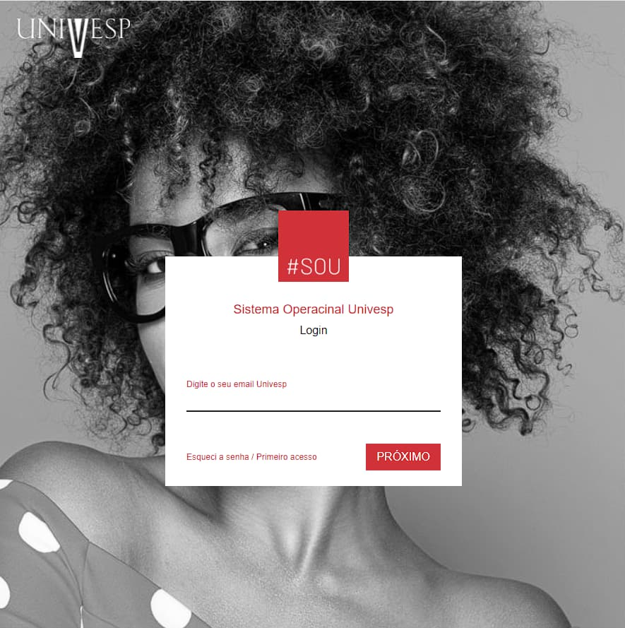
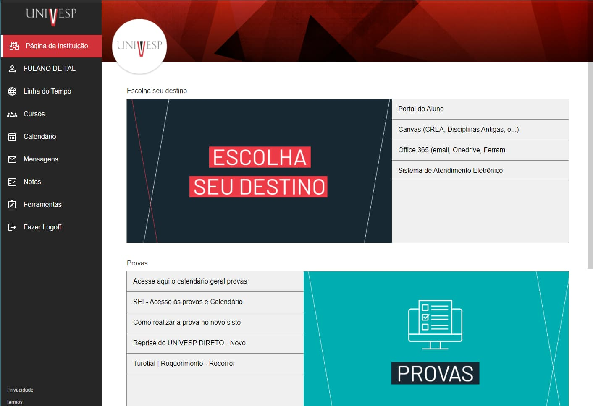
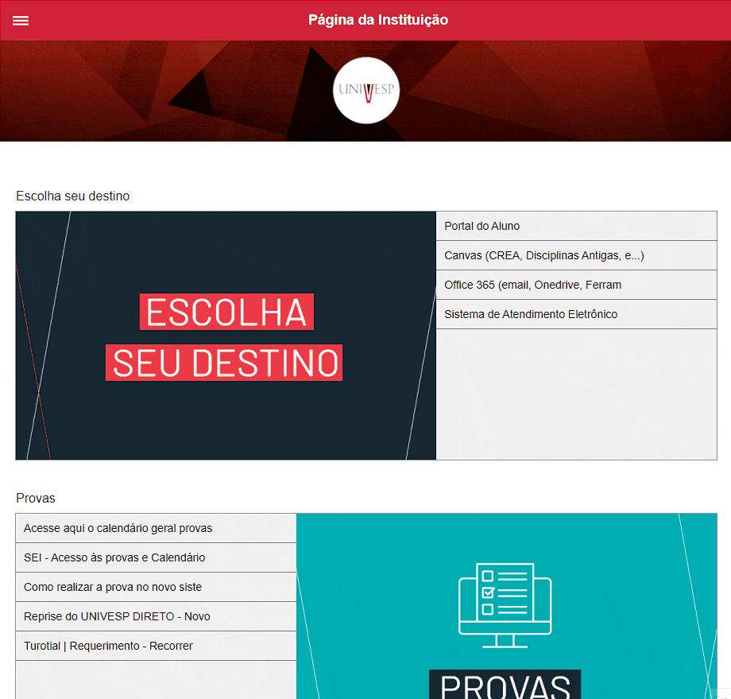
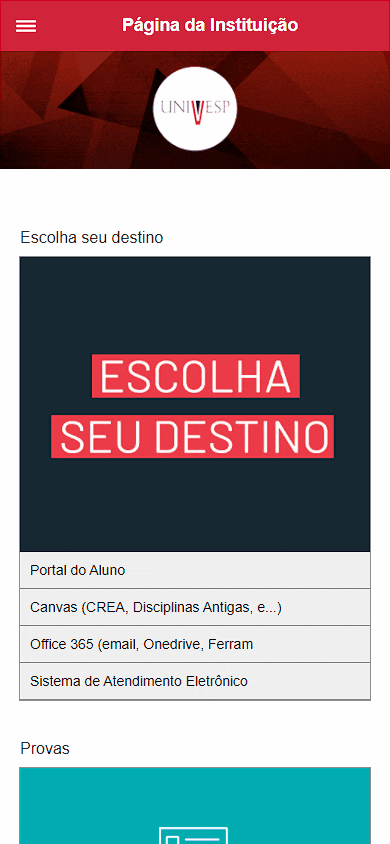

# Clone da Plataforma Univesp

<p style="font-size: 16px;">Este projeto é um clone do site da faculdade Univesp, esta página é feita para aplicação do conhecimento e prática em programação front end. <br>
Este projeto foi desenvolvido para ser meu primeiro tutorial no Youtube.</p>

- Foi desenvolvido com boas práticas de programação
- É totalmente responsivo
- Tem um menu mobile

## Veja toda a serie pelo Youtube

<a href='https://www.youtube.com/watch?v=PNwKu2xVE5I&t=1s&ab_channel=AlbertoCanezin'>Veja a serie completa</a>

## Veja o site no Github Pages

<a href='https://canezinbeto.github.io/clone-univesp/'>Veja o site</a>

## Tecnologias Utilizadas

- JavaScript
- Clean CSS
- CSS3 - FlexBox - CSS Grid
- HTML5

## Visual do Projeto

<p>Tela de login</p>

<br>

<br>
<p>Tela Aluno</p>


<br>
<p>Menu Tablet</p>


<br>
<p>Menu Mobile</p>


<br>
<p>Pré-requisitos</p>
<p>Você precisa ter instalado na sua máquina as ferramentas: <a href="https://git-scm.com/">Git</a>, <a href="https://nodejs.org/en/">Node.js</a> e também <a href="https://code.visualstudio.com/">Vscode</a> com a extensão liveServer</p>

```bash
# Basta clonar o repositório em sua máquina
$ git clone git@github.com:CanezinBeto/clone-univesp.git

# Abrir com o Vscode e visualizar com o liveServer
```

Desenvolvido por Alberto Canezin :rocket: [veja meu LinkeIn](https://www.linkedin.com/in/albertocanezin-dev/)
